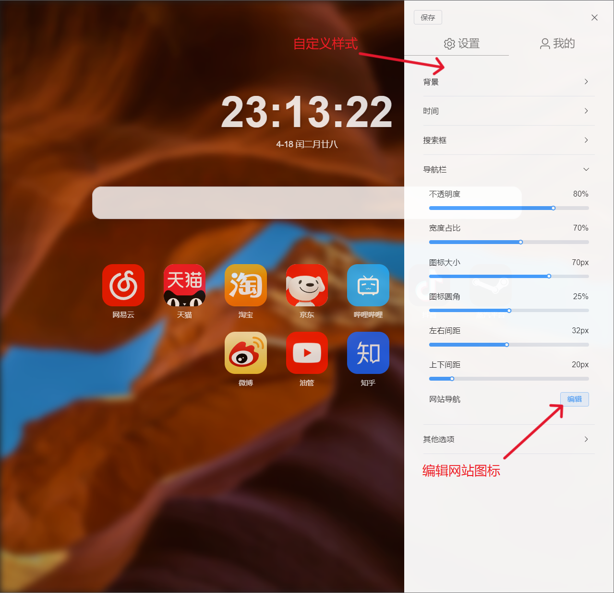
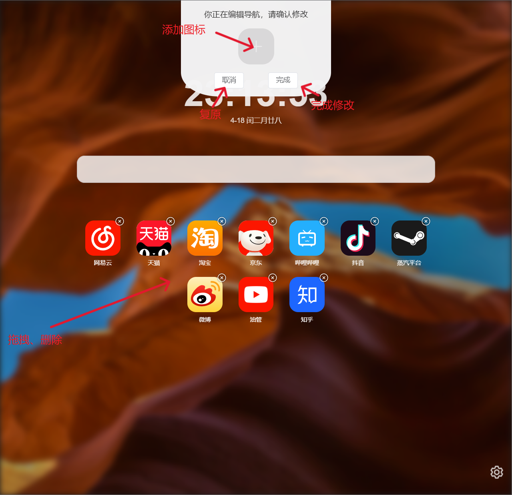

# Home

> 声明：此项目只发布于 Github，基于 MIT 协议，免费且作为开源学习使用。

### 介绍

本项目为个人开发的开源浏览器主页，基于 **Vue3 + Vite + Element Plus**

Demo展示：https://home.waowaowao.cn

### 项目搭建

进入文件目录，**安装依赖**

```shell
npm install
```

**运行**

```shell
npm run dev
```

**项目打包**

```shell
npm run build
```

### Demo展示

1. 自定义修改页面样式以及样式复原：



2. 功能图标，实现拖拽、添加、删除和复原：


